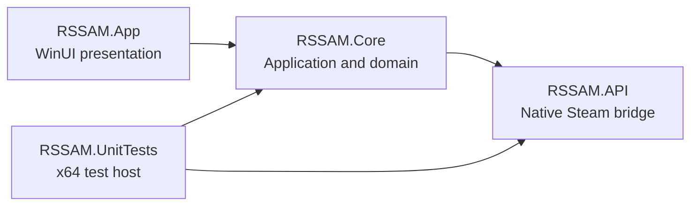

# RSSAM architecture

## Dependency direction



Dependencies point toward the native bridge. `RSSAM.API` has no WinUI dependency, `RSSAM.Core` has no presentation dependency, and `RSSAM.App` does not call native Steam interfaces directly.

## Application layer

`RSSAM.App` owns startup, the custom title bar, navigation, page composition and all WinUI controls. `MainWindow` configures the Windows title bar, theme-aware caption colors, global search and responsive title-bar layout. `ShellPage` owns the navigation pane, page toolbar, loading bar, content frame and status bar.

Content pages implement `IShellContentPage` and expose:

- toolbar items;
- search context and placeholder;
- back-navigation state;
- status text;
- busy state for the global loading bar.

The shell renders left and right toolbar groups independently. Page actions are icon-only buttons with localized tooltips and accessible names. Reload actions can be anchored at the far right through `ShellToolbarItemPlacement.Right`.

## Core layer

`RSSAM.Core` contains reusable application behavior:

- game, achievement, statistic and settings models;
- catalog and game-stat orchestration;
- JSON settings and favorites storage;
- search contracts and providers;
- localization resources and culture selection;
- Valve KeyValue and Steam schema parsing;
- hidden-worker request and response models.

The Core layer reports progress and localized errors without referencing WinUI types.

## Native API layer

`RSSAM.API` contains the x86/x64 Steam client interoperability retained and adapted from Steam Achievement Manager. Native interface tables, callbacks, vtable calls and string marshalling remain isolated in this project so architecture-specific changes do not leak into the application UI.

## Isolated Steam workers

The visible WinUI process does not retain a live native Steam client session. Public Core services serialize one operation, start the matching RSSAM executable in hidden worker mode and receive a serialized response.

This design provides:

- a fresh Steam App ID context for every selected game;
- isolation between catalog and game-specific operations;
- serialized access to native Steam pipe and user lifecycle calls;
- recovery from native initialization failures without restarting the visible window;
- separate x86 and x64 worker behavior matching the running application.

Catalog operations run without a game App ID. Load, save and reset operations set `SteamAppId` before native initialization. Temporary request and response data is removed after each operation.

## Shell and window layout

```text
Custom title bar
NavigationView
  ├─ navigation pane
  └─ content column
       ├─ page toolbar
       ├─ indeterminate loading bar when busy
       └─ active page
Optional status bar
```

The shell uses shared theme resources so the title bar, toolbar, navigation area, page background and status bar remain visually consistent. Theme changes also update native minimize, maximize and close button colors.

## Navigation and search

The `NavigationView` owns the complete shell area above the status bar. Pages are cached in the content frame. Returning to Games closes the current detail view and returns to the catalog.

The title bar contains one global search field. Its behavior depends on the active page and tab:

- game-library search filters games;
- achievement search filters achievements;
- statistics search filters statistics;
- settings and changelog pages hide the search field.

New searchable pages should provide a stable search context instead of adding a second search box.

## Loading and notifications

`ManagerPage.IsBusy` exposes catalog and game-data loading to the shell. `ShellPage` displays one indeterminate progress bar directly below the toolbar. Page-local progress rings are intentionally not used.

Status messages always reach the bottom status bar. A floating global InfoBar is reserved for user-initiated actions, completion notices and errors; automatic startup operations remain unobtrusive.

## Dialogs

All WinUI `ContentDialog` instances are shown through `DialogService`. The service serializes requests for the active `XamlRoot`, applies the active theme and uses shared dialog styles. Pages do not maintain independent dialog queues.

## Persistent state

`%LOCALAPPDATA%\RSSAM\settings.json` stores interface and window state. The schema includes language, theme, backdrop, navigation mode, status-bar visibility, game-library view, startup behavior, window placement, confirmations and search queries.

`%LOCALAPPDATA%\RSSAM\favorites.json` stores favorite Steam App IDs separately. Resetting application settings therefore does not remove favorites. Both services use atomic replacement and support isolated data directories for unit tests.

## Localization

`LocalizationService` loads embedded JSON dictionaries from `RSSAM.Core/Localization/Resources` and falls back to copied resource files when required. The English dictionary is the missing-key fallback.

Supported interface and Steam schema languages:

| Culture | Interface | Steam schema language |
| --- | --- | --- |
| `de-DE` | Deutsch | `german` |
| `en-US` | English | `english` |
| `es-ES` | Español | `spanish` |
| `fr-FR` | Français | `french` |
| `tr-TR` | Türkçe | `turkish` |

All dictionaries must contain identical keys and compatible composite-format placeholders. The in-app changelog is intentionally English-only and comes from the root `CHANGELOG.md`.

## Extension points

New pages belong under `RSSAM.App/Presentation/Views`. Reusable application logic belongs in Core. Native Steam additions belong in API. Shared shell actions should use `ShellToolbarItem` rather than adding page-specific command bars.

Before adding a dependency between projects, preserve the existing direction shown above.
